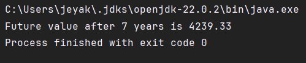

## Exercise 7: Financial Forecasting

Recursion:
1. Recursion is a method in which a function calls itself to solve smaller sub-problems.
2. It requires a base condition to stop and the recursive case.

### Time Complexity:
* Total recursive calls = n (in our case refers to the years)
* Time complexity = O(n)

### Optimization:
* recursion may cause stack overflow for larger n values.
* In that case we can use iteration.
* Otherwise we can use the formula directly.

## Output:

