# Hands on 1 - Write queries on country table using Query Methods 

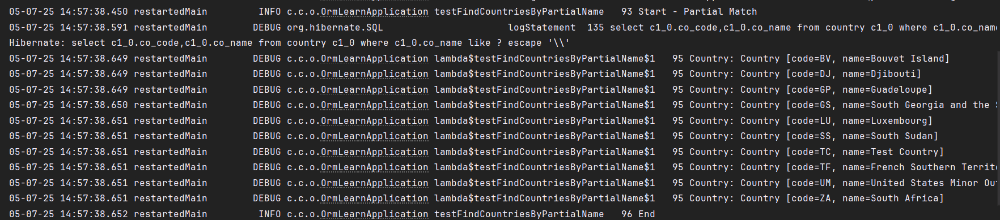

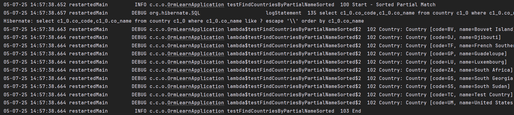

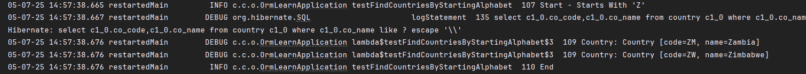

# Hands on 2 - Write queries on stock table using Query Methods 

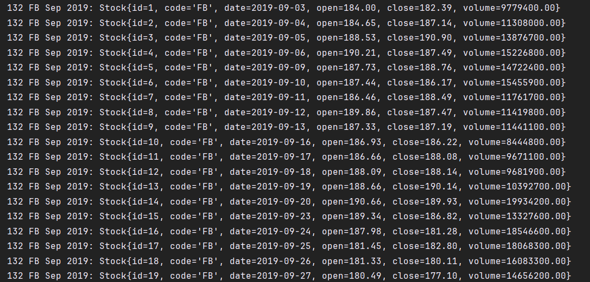

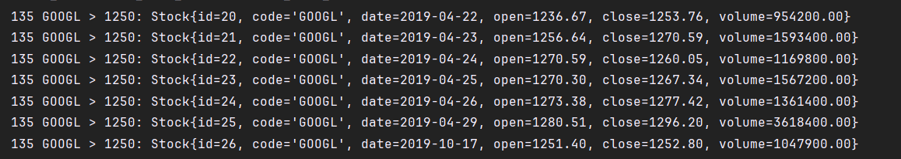

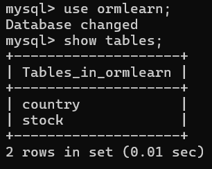

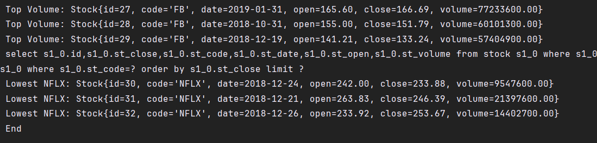

# Hands on 3 - Create payroll tables and bean mapping 

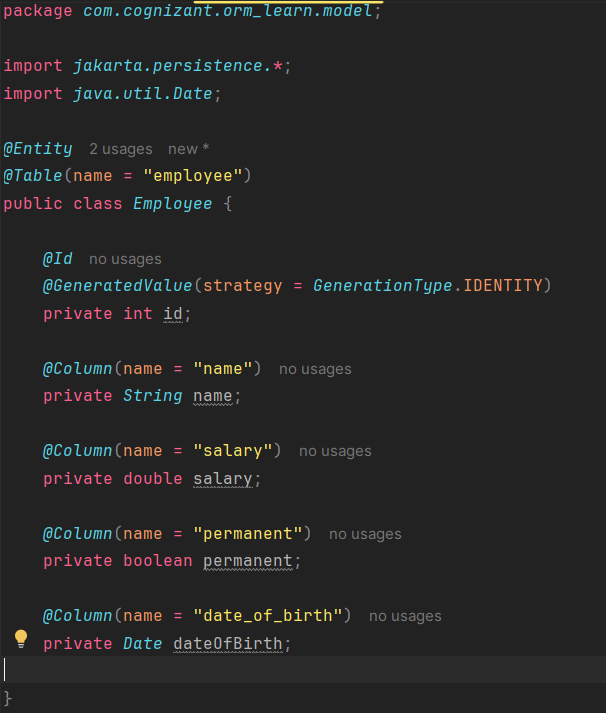

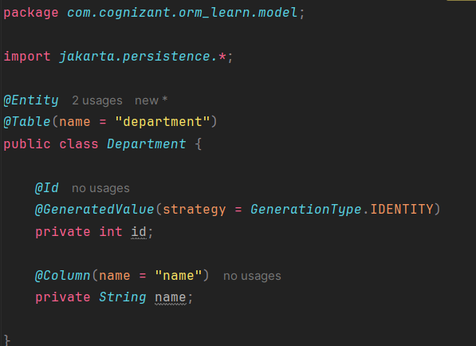

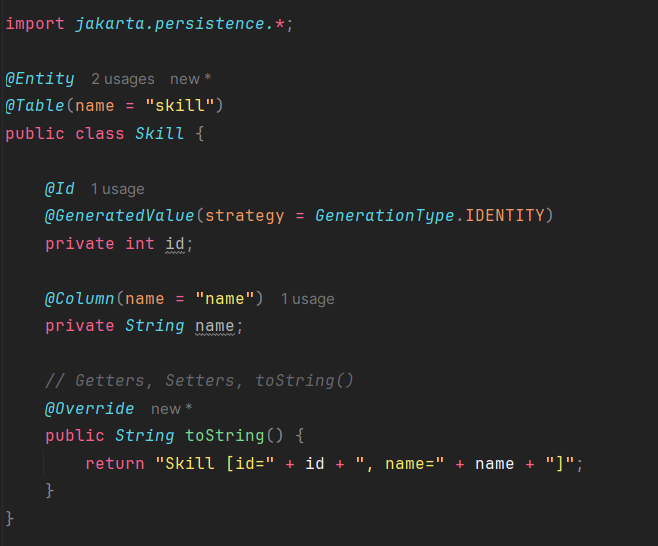

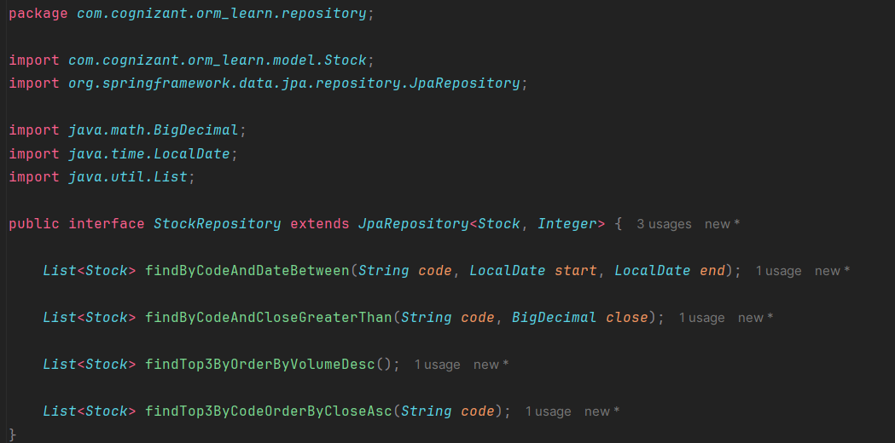

# Hands on 4 - Implement many-to-one relationship between Employee and Department 

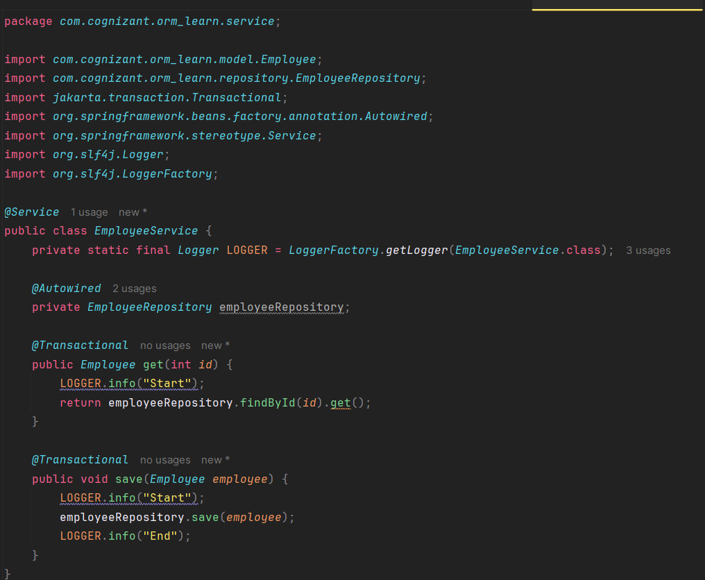

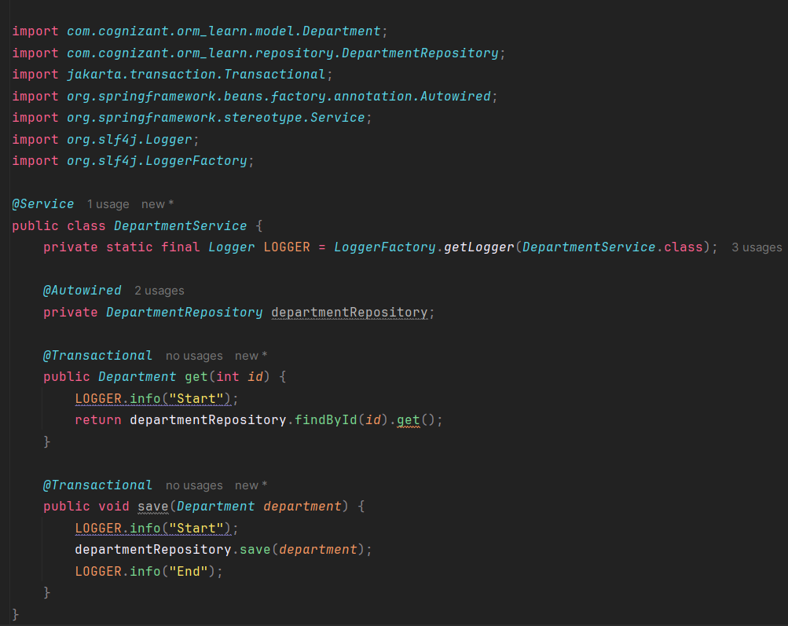

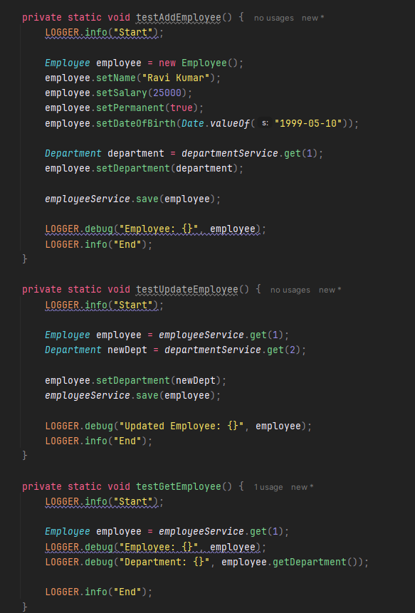

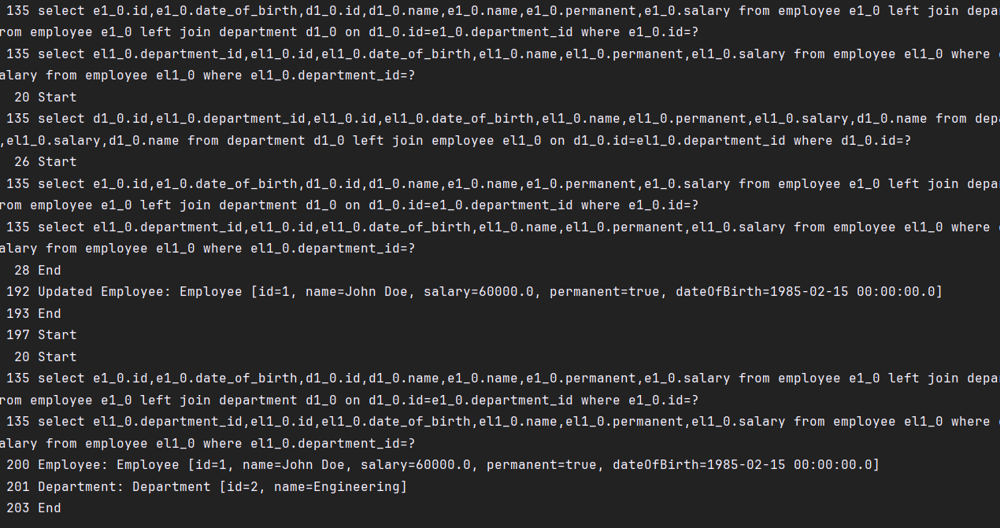

# Hands on 5 - Implement one-to-many relationship between Employee and Department 

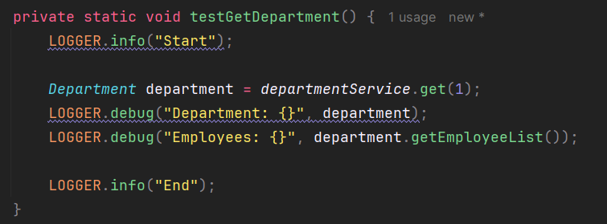

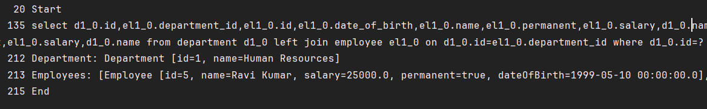

# Hands on 6 - Implement many-to-many relationship between Employee and Skill 

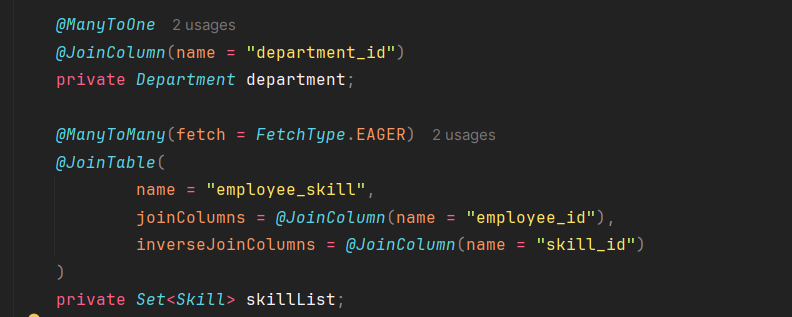

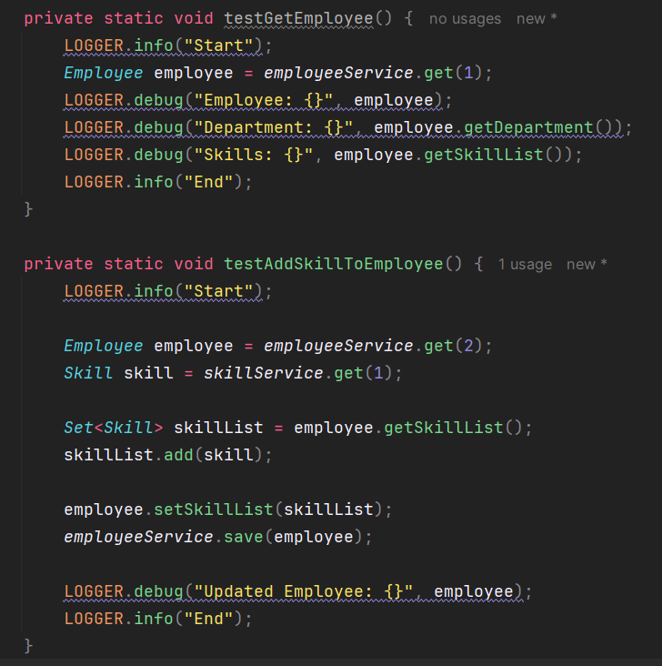
