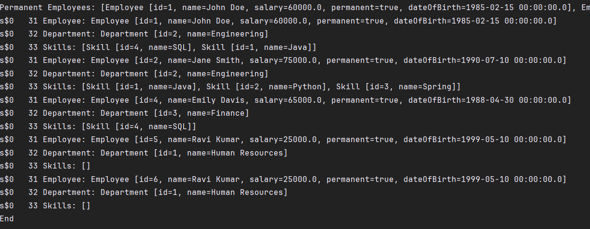
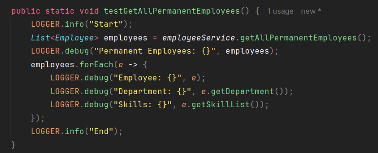
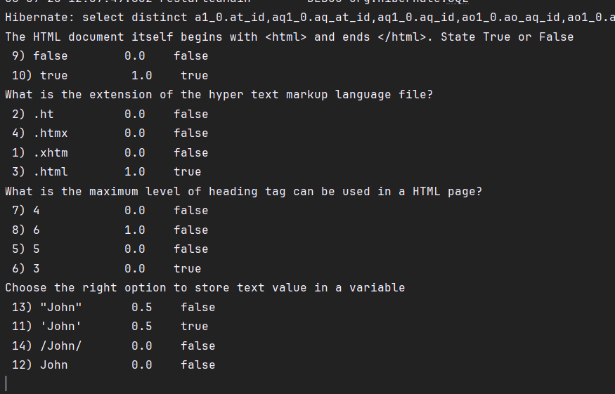
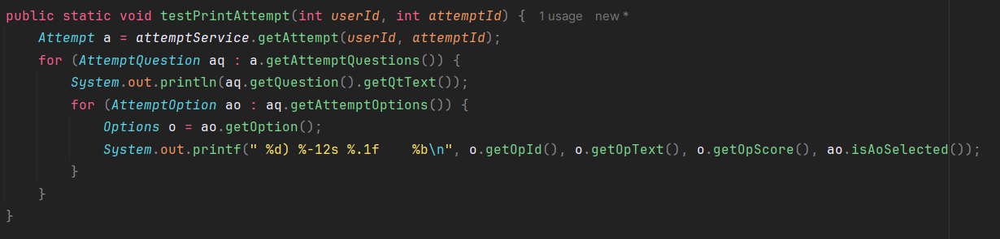
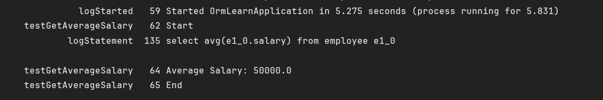
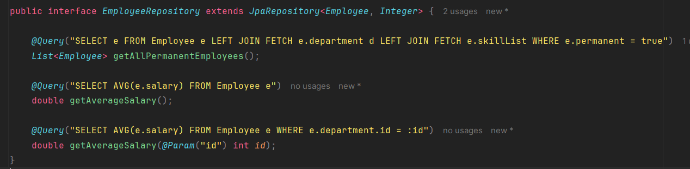
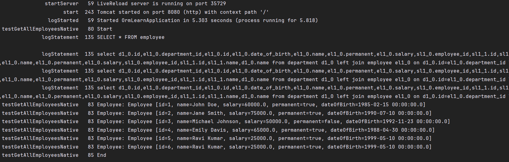
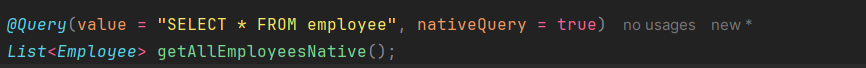

# Hands on 2 - Get all permanent employees using HQL 

# Hands on 3 - Fetch quiz attempt details using HQL 

# Hands on 4 - Get average salary using HQL 

# Hands on 5 - Get all employees using Native Query 

